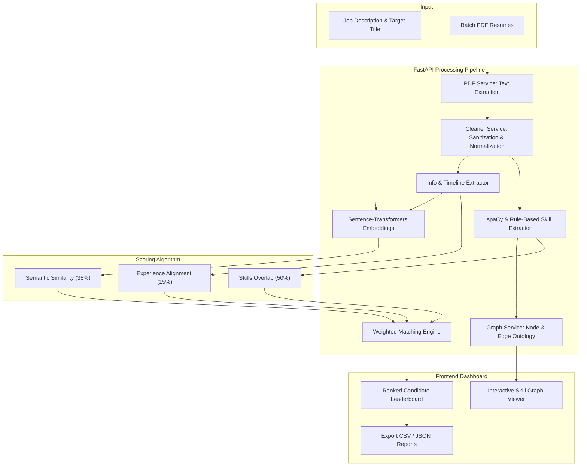

# meetMux — Intelligent Resume Matching & Automated Candidate Skill Graph Maker

<div align="center">

[](https://fastapi.tiangolo.com)
[](https://react.dev)
[](https://vitejs.dev)
[](https://python.org)
[](https://spacy.io)
[](https://sbert.net)
[](https://opensource.org/licenses/MIT)

<p align="center">
  <strong>An end-to-end AI platform that parses resumes, extracts candidate skills, maps visual skill graph ontologies, and scores candidates against job descriptions using hybrid semantic embeddings.</strong>
</p>

</div>

---

## 🚀 Overview

**meetMux** is an automated talent intelligence and resume evaluation system designed to streamline technical recruitment. Instead of relying solely on brittle keyword matching or black-box LLM scoring, **meetMux** combines:

1. **Deterministic Skill Ontology Matching** — Matches required and preferred skills, identifying exact gaps and ecosystem competencies.
2. **Dense Semantic Embeddings** (`sentence-transformers/all-MiniLM-L6-v2`) — Understands contextual experience and qualitative alignment beyond raw keywords.
3. **Experience Timeline Extraction** — Heuristically parses employment history, roles, and career tenure.
4. **Interactive Skill Knowledge Graphs** — Visualizes relationship dependencies between candidate abilities and job requirements (e.g., *Python ➔ FastAPI*, *React ➔ TypeScript*, *Docker ➔ Kubernetes*).
5. **Dynamic Candidate Leaderboard** — Batch-evaluates multiple resumes against a job description, ranking applicants in real-time with comprehensive breakdown metrics.

---

## ✨ Key Features

### 📄 Multi-Resume PDF Extraction & Cleaning
- Fast text extraction via `pypdf` with error resilience against corrupt or image-only documents.
- Rule-based text cleaning and sanitization (normalizing whitespace, stripping artifacts, email & phone extraction).

### 🧠 Natural Language Skill & Timeline Extractor
- Extracts normalized candidate profiles including:
  - Personal Information (Full Name, Email, Phone Number)
  - Extracted Technical & Soft Skills mapped against a rich tech taxonomy
  - Chronological Timeline & Work Experience (Company, Role, Duration, Responsibilities)
  - Education history

### 🕸️ Automated Candidate Skill Graph Maker
- Generates interactive, color-coded node-edge relationship networks:
  - 🟢 **Matched Required Skills** (Core job requirements present in resume)
  - 🔵 **Matched Preferred Skills** (Nice-to-have skills present in resume)
  - 🟣 **Candidate Extra Skills** (Value-added competencies beyond job description)
  - 🔴 **Missing Required Skills** (Critical skill gaps)
  - 🟡 **Missing Preferred Skills** (Secondary skill gaps)
- Maps architectural ecosystem linkages (frameworks, runtime environments, databases, and DevOps tooling).

### ⚖️ Weighted Composite Scoring Engine
Scores each candidate out of 100 based on a balanced, transparent formula:
- **Skill Match (50%)**: Direct overlap of required skills (80% weight) + preferred bonus skills (20% weight).
- **Semantic Similarity (35%)**: High-dimensional cosine similarity between the job description and candidate profile using `all-MiniLM-L6-v2`.
- **Experience Alignment (15%)**: Evaluated against the role's minimum required tenure.

### 🏆 Interactive Recruitment Dashboard
- **Drag-and-Drop Batch Upload**: Upload dozens of resumes simultaneously.
- **Instant Leaderboard**: Sorted by match score with medal badges (🥇 Top Match, 🥈 Strong Contender, etc.).
- **Candidate Deep Dive**: Modal / expandable views showing skill coverage, missing skills checklist, timeline breakdown, and interactive graph explorer.
- **Export Capabilities**: Export ranked candidate leaderboards directly to **CSV** or **JSON**.
- **Delightful UX**: Built with modern typography, glassmorphism, micro-animations, toast alerts, and celebratory confetti effects.

---

## 🏗️ Architecture & Workflow



---

## 🛠️ Technology Stack

| Domain | Technology | Purpose |
|---|---|---|
| **Backend Framework** | [FastAPI](https://fastapi.tiangolo.com/) | High-performance asynchronous Python API |
| **Server** | [Uvicorn](https://www.uvicorn.org/) | Lightning-fast ASGI production web server |
| **NLP & Extraction** | [spaCy](https://spacy.io/) | Entity parsing and skill tokenization |
| **Vector Embeddings** | [Sentence-Transformers](https://sbert.net/) (`all-MiniLM-L6-v2`) | Dense semantic similarity calculation |
| **PDF Processing** | [PyPDF](https://pypi.org/project/pypdf/) | Fast extraction of text streams and page metadata |
| **Frontend Framework** | [React 19](https://react.dev/) + [Vite](https://vitejs.dev/) | Ultra-responsive SPA architecture |
| **Icons & UI** | [Lucide React](https://lucide.dev/) | Clean iconography |
| **Feedback & Polish** | [React Hot Toast](https://react-hot-toast.com/) & [Canvas-Confetti](https://www.npmjs.com/package/canvas-confetti) | Toast notifications and celebratory visual flair |
| **Network Client** | [Axios](https://axios-http.com/) | HTTP API communication |

---

## 📂 Repository Structure

```text
meetMux/
├── backend/
│   ├── app/
│   │   ├── api/
│   │   │   ├── graph.py             # Skill graph endpoints
│   │   │   ├── jobs.py              # Job description parsing & skill requirement analysis
│   │   │   ├── match.py             # Batch resume matching & ranking endpoint
│   │   │   └── resumes.py           # Single resume upload & profile parser
│   │   ├── services/
│   │   │   ├── cleaner_service.py   # Text sanitation, normalization & regex cleaning
│   │   │   ├── embedding_service.py # Sentence-Transformers semantic cosine calculation
│   │   │   ├── graph_service.py     # Skill relationship knowledge base & graph builder
│   │   │   ├── info_extractor.py    # Name, contact info & experience extraction
│   │   │   ├── job_service.py       # Required/preferred skill analysis from job descriptions
│   │   │   ├── matching_engine.py   # Weighted multi-factor scoring algorithm
│   │   │   ├── pdf_service.py       # PyPDF text extraction
│   │   │   ├── skill_extractor.py   # Normalized technical skill taxonomy matching
│   │   │   └── timeline_extractor.py# Employment history & role timeline parsing
│   │   └── main.py                  # FastAPI app entrypoint, CORS & route registration
│   ├── requirements.txt             # Python backend dependencies
│   ├── verify_all.py                # Automated backend endpoint & pipeline test suite
│   └── .env.example                 # Environment variables template
├── frontend/
│   ├── src/
│   │   ├── components/
│   │   │   └── SkillGraphView.jsx   # Interactive node-edge skill graph visualizer
│   │   ├── pages/
│   │   │   ├── LoginPage.jsx        # Authentication portal UI
│   │   │   ├── UploadPage.jsx       # Job description & multi-resume upload panel
│   │   │   └── ResultsPage.jsx      # Leaderboard, score breakdowns, filters & export
│   │   ├── App.jsx                  # Main application state orchestrator
│   │   ├── index.css                # Custom modern styling & animations
│   │   └── main.jsx                 # React root mount
│   ├── index.html                   # HTML entrypoint with DM Sans typography
│   ├── package.json                 # Node dependencies and scripts
│   └── vite.config.js               # Vite build configuration
├── sample_resumes/                  # Pre-packaged PDF resumes for instant testing
│   ├── Gordon_Ramsay_Executive_Chef.pdf
│   ├── John_Smith_Frontend_Dev.pdf
│   └── Sarah_Connor_Senior_Backend.pdf
├── .gitignore                       # Production gitignore (excludes venvs, node_modules, .env)
└── README.md                        # Documentation
```

---

## ⚡ Quick Start Guide

### Prerequisites
- **Python 3.10+**
- **Node.js 18+** & **npm**
- **Git**

---

### 1. Clone the Repository
```bash
git clone https://github.com/Roshani108/Intelligent-Resume-Matching-Automated-Candidate-Skill-Graph-Maker.git
cd Intelligent-Resume-Matching-Automated-Candidate-Skill-Graph-Maker
```

---

### 2. Backend Setup

```bash
# Navigate to backend directory
cd backend

# Create and activate a Python virtual environment
# On Windows (PowerShell):
python -m venv venv
.\venv\Scripts\Activate.ps1

# On macOS/Linux:
# python3 -m venv venv
# source venv/bin/activate

# Install required dependencies
pip install -r requirements.txt

# Start the FastAPI development server
uvicorn app.main:app --reload --host 0.0.0.0 --port 8000
```

> 💡 **Backend will be live at:** [http://localhost:8000](http://localhost:8000)  
> 📖 **Interactive Swagger UI:** [http://localhost:8000/docs](http://localhost:8000/docs)  
> 🩺 **Health Check:** [http://localhost:8000/health](http://localhost:8000/health)

---

### 3. Frontend Setup

In a new terminal window:

```bash
# Navigate to frontend directory
cd frontend

# Install npm dependencies
npm install

# Start the Vite development server
npm run dev
```

> 🌐 **Frontend will be live at:** [http://localhost:5173](http://localhost:5173)

---

## 🧪 Testing with Sample Resumes

We include sample resumes in the [`sample_resumes/`](./sample_resumes/) folder for testing:

1. Open [http://localhost:5173](http://localhost:5173) in your browser.
2. In the **Job Description** box, enter a role such as:
   ```text
   Senior Python & React Fullstack Engineer
   We are looking for an experienced developer with strong expertise in Python, FastAPI, and React.
   Experience with Docker, PostgreSQL, and Git is required.
   Nice to have: Machine Learning, AWS, or TypeScript.
   ```
3. Drag & drop the 3 sample PDFs from `sample_resumes/`:
   - `Sarah_Connor_Senior_Backend.pdf` ➔ Expected high score for backend & Python stack.
   - `John_Smith_Frontend_Dev.pdf` ➔ Expected high score for frontend & React stack.
   - `Gordon_Ramsay_Executive_Chef.pdf` ➔ Expected low match score (culinary profile).
4. Click **Match & Rank Candidates**.
5. Observe real-time leaderboard ranking, skill coverage badges, gap analysis, and interactive skill graphs!

---

## 📡 API Reference

### Core Endpoints

| Method | Endpoint | Description | Payload / Parameters |
|---|---|---|---|
| `GET` | `/` | Root Welcome & Docs Link | None |
| `GET` | `/health` | Server Health Status | None |
| `POST` | `/api/resumes/upload` | Parse Single PDF Resume | `file: UploadFile` |
| `POST` | `/api/jobs/analyze` | Parse Job Description Requirements | `title: str`, `description: str` |
| `POST` | `/api/match` | Batch Match Multiple Resumes against Job | `job_title`, `job_description`, `resumes: List[UploadFile]` |
| `POST` | `/api/graph/skills` | Generate Skill Relationship Graph | `candidate_skills: List[str]`, `required_skills`, `preferred_skills` |

---

## 📊 Scoring Methodology Explained

The composite match score ($S_{total}$) is calculated as:

$$S_{total} = (0.50 \times S_{skills}) + (0.35 \times S_{semantic}) + (0.15 \times S_{experience})$$

Where:
- **$S_{skills}$**: Direct overlap ratio of required skills (80% weight) combined with preferred skills bonus (20% weight).
- **$S_{semantic}$**: Cosine similarity between dense vector representations of the candidate's aggregated profile and the job description generated by `sentence-transformers/all-MiniLM-L6-v2`.
- **$S_{experience}$**: Candidate's estimated career years divided by minimum specified years (capped at 100%).

---

## 🌐 Live Deployment Guide (Single Live Link)

**meetMux** is configured as a unified fullstack application — FastAPI directly serves the pre-built React frontend SPA and handles all API routes under the same origin. This means you deploy **one single service** and get **one single live link** with zero CORS setup!

### 🌟 1-Click Single Live Link on Render (Free)
1. Go to [Render Dashboard](https://dashboard.render.com/) and sign in with your GitHub account.
2. Click **New +** ➔ **Blueprint**.
3. Select your repository: `Roshani108/Intelligent-Resume-Matching-Automated-Candidate-Skill-Graph-Maker`.
4. Render will detect [`render.yaml`](./render.yaml) and provision the unified service:
   - **Name**: `meetmux`
   - **Environment**: Python 3.11
   - **Root Directory**: `backend`
   - **Build Command**: `pip install -r requirements.txt && python -m spacy download en_core_web_sm`
   - **Start Command**: `uvicorn app.main:app --host 0.0.0.0 --port $PORT`
5. Click **Apply**.
6. When the build finishes, you will receive **one single live URL** (e.g. `https://meetmux.onrender.com`):
   - Visiting `/` loads the interactive React application.
   - All API endpoints `/api/...` execute seamlessly on the same domain.
   - Interactive Swagger API docs are available at `/docs`.

---

### Alternative: Manual Web Service on Render
If you prefer creating a Web Service manually:
1. In Render, select **New +** ➔ **Web Service**.
2. Connect your GitHub repository.
3. Configure the settings:
   - **Root Directory**: `backend`
   - **Runtime**: `Python 3`
   - **Build Command**: `pip install -r requirements.txt && python -m spacy download en_core_web_sm`
   - **Start Command**: `uvicorn app.main:app --host 0.0.0.0 --port $PORT`
4. Click **Deploy Web Service** ➔ You get your single live link!

---

### Alternative: Single Docker Container
Run both the frontend and backend in a single Docker container:

```bash
cd backend
docker build -t meetmux .
docker run -p 8000:8000 meetmux
```
Open [http://localhost:8000](http://localhost:8000) to access the complete application.

---

## 🤝 Contributing

Contributions, issues, and feature requests are welcome!
Feel free to check the [issues page](https://github.com/Roshani108/Intelligent-Resume-Matching-Automated-Candidate-Skill-Graph-Maker/issues).

1. Fork the Project
2. Create your Feature Branch (`git checkout -b feature/AmazingFeature`)
3. Commit your Changes (`git commit -m 'Add some AmazingFeature'`)
4. Push to the Branch (`git push origin feature/AmazingFeature`)
5. Open a Pull Request

---

## 📄 License

This project is open-source and licensed under the [MIT License](LICENSE).

---

<div align="center">
  Developed by <a href="https://github.com/Roshani108">Roshani Kumari</a> • Powered by FastAPI & React
</div>
